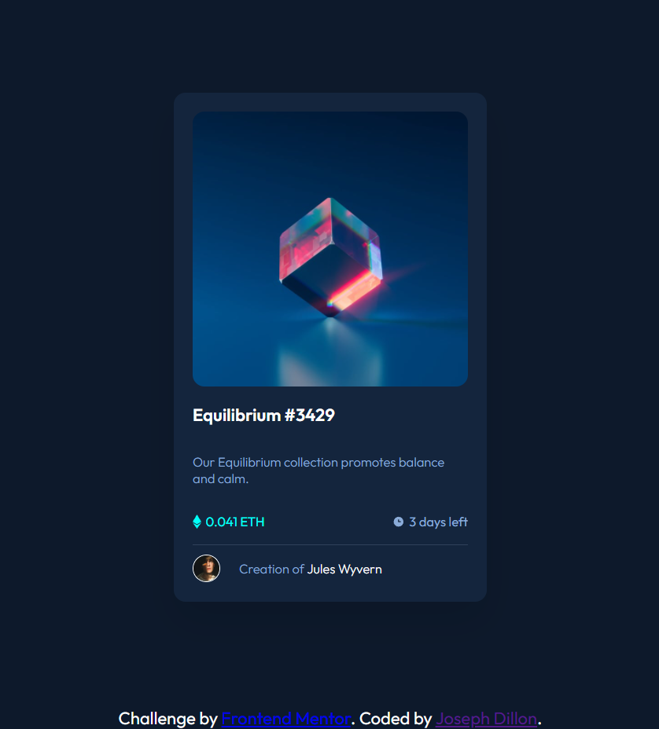
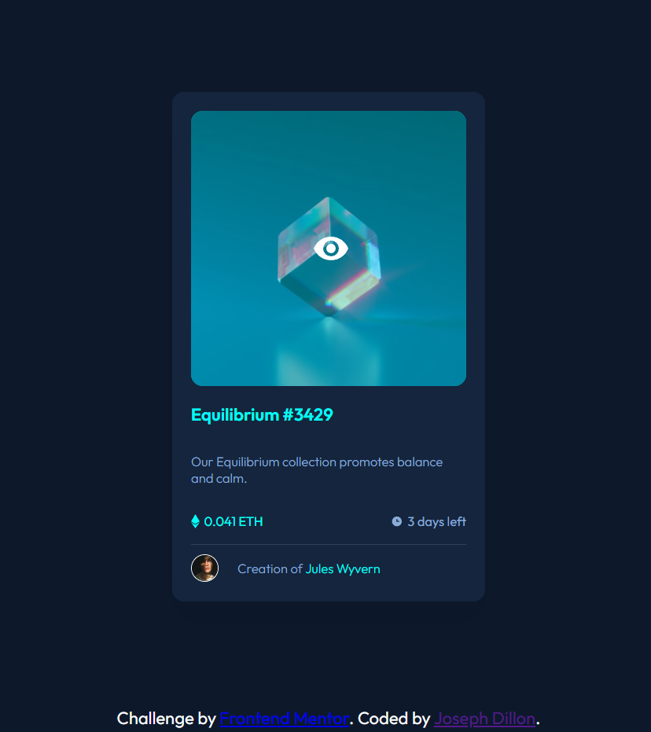

# Frontend Mentor - NFT preview card component solution

This is a solution to the [NFT preview card component challenge on Frontend Mentor](https://www.frontendmentor.io/challenges/nft-preview-card-component-SbdUL_w0U). Frontend Mentor challenges help you improve your coding skills by building realistic projects.

## Table of contents

- [Overview](#overview)
  - [The challenge](#the-challenge)
  - [Screenshot](#screenshot)
  - [Links](#links)
- [My process](#my-process)
  - [Built with](#built-with)
## Overview

I chose this challenge as something simple to do where I could experiment with compiling SCSS files via npm scripts. All said and done, I probably have 2 hours of actual work in this.

### The challenge

Users should be able to:

- View the optimal layout depending on their device's screen size
- See hover states for interactive elements

### Screenshot

Desktop (and mobile)

Desktop Active

### Links

- Solution URL: [Github](https://github.com/JDillon522/FrontendMaster-nft-preview-card)
- Live Site URL: [Github Pages](https://jdillon522.github.io/FrontendMaster-nft-preview-card/)

## My process
I started out with just setting up the project to compile my SCSS files. From there it was a simple matter of plug and play.

### Built with

- Semantic HTML5 markup
- SCSS
- Flexbox
- Mobile-first workflow

